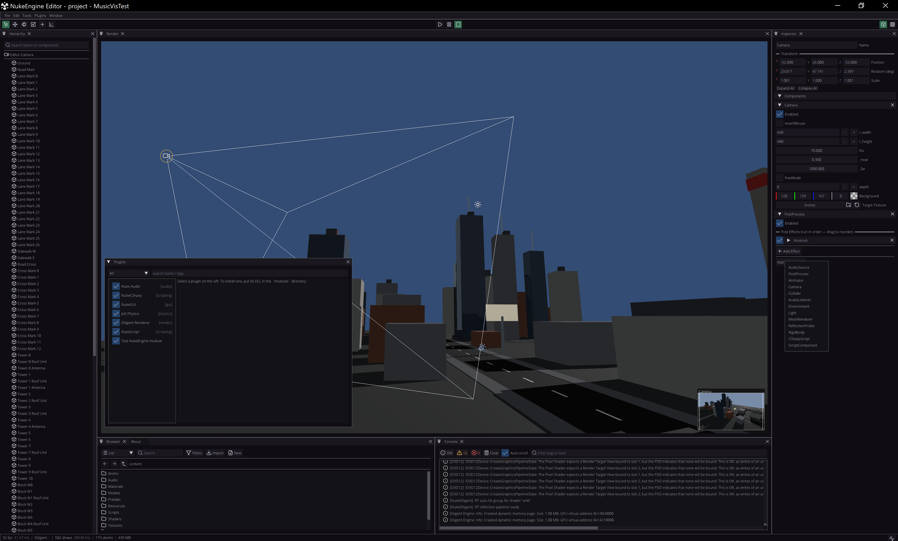

# NukeEngine — Editor

The editor host of [NukeEngine](https://github.com/Luastris/NukeEngine-Eco) by
[Luastris](https://luastris.com) (`NukeEngine-Editor.exe`, ImGui 1.92 via the shared
[NukeImGui](https://github.com/Luastris/NukeImGui) DLL — which never ships with a game).

## What it does

- Dockable ImGui workspace with interface icons, persistent editor state, PIE
  (play-in-editor, WYSIWYG), gizmos + debug drawing, clickable entity icons.
- **Browser** (tiles/list/tree): create/rename/DnD/open, forward-back navigation (M4/M5),
  packed sessions list pak/mod content too. **Hierarchy** with DnD; drop an atom onto the
  browser to save a prefab; prefab ↔ instance sync both ways.
- Reflection-driven **inspector** (typed pickers everywhere — no raw text fields for
  enumerable values), per-file-type editors (text with syntax highlighting, material,
  mesh/prefab 3D preview, audio player) in native OS windows.
- Undo/redo history, cascade deletion with link clearing, external-change detection with
  hierarchical merge resolving.
- **Console** (severity filters, text filter, copy, double-click any `path(line)`
  reference — compiler errors included — to jump into your IDE at the exact line),
  status bar with a module-facing API, Preferences with external IDE detection
  (VS / Rider / VSCode / Notepad++; files open in the RUNNING instance).
- **Project Settings:** plugins, default world, rebindable hotkey map, packaging options,
  the Mods panel (game list vs editor-session list).
- **Packaging:** File → Package Project builds Release through the superbuild first, then
  produces the complete game `dist/`; File → Package Mod authors `.numod` point-diff
  overlays. File → Build Engine runs the whole superbuild with Console output and status
  bar progress.

## Building

Preferred: the superbuild at the ecosystem root
([NukeEngine-Eco](https://github.com/Luastris/NukeEngine-Eco)) — one command builds the
engine, this editor and every present module.

Standalone: the editor builds from its own `CMakeLists.txt` (C++20; MSVC v143 on Windows)
next to the [NukeEngine](https://github.com/Luastris/NukeEngine) checkout; it links the
`NukeEngine` and `NukeImGui` CMake targets, so those must be in the same configure (the
superbuild arranges this). Dependencies come from the shared classic vcpkg pool via
`CMAKE_PREFIX_PATH`; `VCPKG_ROOT` must be set. Run dir = `NukeEngine/x64/<Config>` (the
post-build deploys `dist/` config/fonts and the vcpkg runtime DLLs there).

## Diagnostics

- **`NUKE_GPU_VALIDATION`** (environment variable, Debug builds): off by default. Set it to
  `1` and relaunch to enable the D3D12 validation layer + DRED breadcrumbs — the real cause of
  a device-removed / GPU fault then lands in the Console instead of a bare fence assert. It
  costs frame rate, so leave it off unless the renderer is actually crashing (no rebuild needed
  to flip it). Release builds never compile it in.
- Benchmark FPS in **Release** — a Debug build runs an unoptimised Diligent core. Vertical sync
  (config `window.vsync`, or `Game.SetVSync(false)` at runtime) caps the frame rate to the
  display refresh.

## Extending

The editor loads the same modules the engine does — write a plugin once and it works in
both the editor and shipped games. Start from the pristine, fully commented sample:
[TestNUKEModule](https://github.com/Luastris/TestNUKEModule).
